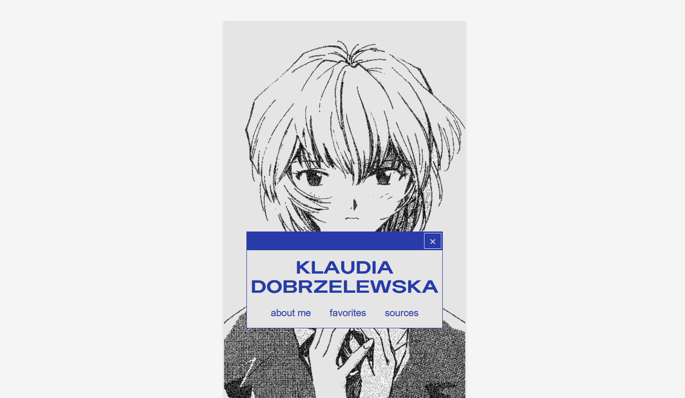

# Web App From Scratch @cmda-minor-web 2023 - 2024

## Documentatie
**thema, idee, code, breakdown schets**

## Proces
### Dag 1 - 6 februari 2024
Tijdens dag 1 heb ik vooral gekeken wat ik wilde qua concept. Ook snapte ik toen nog niet helemaal hoe ik een JSON file moest aanmaken en hoe ik deze moest koppelen aan mijn website. Tijdens de les hebben de docenten uitgelegd hoe we dat moesten doen. Hieronder zijn de screenshots te zien van mijn eerste JSON file en mijn API fetch code die ik heb gebruikt.

### Dag 2 - 7 februari 2024
Dag 2 heb ik vooral verder besteed aan het ontwerpen van mijn concept. Mijn eerste concepten hadden niet echt een microinteractie erin zitten, waardoor ik een beetje moeite had met kiezen wat ik wilde doen. Hierdoor heb ik een hoop schetsen gemaakt. Toen ik eindelijk had gekozen wat ik ongeveer wilde ben ik begonnen aan de mobiele basis layout van mijn CSS. 

**FOTO'S SCHETSEN TOEVOEGEN!!!!!!**

### Dag 3 - 8 februari 2024
Na een nachtje slapen vond ik mijn layout toch niks en ben ik weer opnieuw begonnen (ja ik word ook gek van mezelf). Deze keer was het wel snel raak en ben ik meteen begonnen aan de CSS. Ik heb mijn mobiele layout nu grotendeels af. Ook heb ik de eerste kleine functionaliteit erin verwerkt, namelijk het openen en sluiten van de een informatie vakje. 

Deze dag heb ik ook mijn aantekeningen netjes gemaakt van de afgelopen dagen, deze zijn te vinden op mijn [Notion](https://obvious-seal-dd9.notion.site/Minor-Web-Development-6e526033f6244a08af249c72653b22b8?pvs=4).

### Dag 4 - 9 februari 2024
Vandaag heb ik vooral kleine dingetjes goed werkend gemaakt die ik in eerste instantie slordig heb gecodeerd. Denk hierbij aan:
- Vakje met x in de hoek mee laten bewegen bij groter en kleiner worden van scherm
- Als gebruikers hoveren over het x vakje de muis een pointer maken. Dit ging eerst mis door pointer-events:none;. Ik heb bij de .show class nu ook pointer-events:all; toegevoegd wat dit heeft opgelost.
- De main articles goed positioneren over de header heen zonder position: absolute; te gebruiken

- En als laatste mijn JavaScript goed werekend gekregen. Lange tijd snapte ik niet helemaal waarom mijn JS het niet goed deed. Ik had alles goed in de file gezet, toch? Ik las alles 5 keer na en probeerde het nog op allerlei andere manieren, maar ik zag mijn fout compleet niet in. Eindstand na 2 uur staren naar het scherm keek ik naar mijn HTML en realiseerde ik me dat ik per ongeluk bij het kopieren van de <articles> ook de <main> had overgenomen en hierdoor dus de favorites en sources niet geselecteerd konden worden met document.querySelector. Na deze realisatie ben ik 5 jaar van mijn levensduur kwijtgeraakt, denk ik. Na dit te aanpassen deed mijn JavaScript het gewoon goed. Joepie. 

### Dag 5 - 12 februari 2024
Helaas heb ik in het weekend vrij weinig kunnen doen door werk, dus dit was het eerst volgende moment waarop ik aan het project kon zitten. Vandaag heb ik mijn homescherm volledig responsief gemaakt. 

Vervolgens merkte ik ook dat ik de "x"-button beter ook een echte button kon maken, dan een ::after element. Dit heb ik gedaan, wat betekende dat ik ook mijn JavaScript moest aanpassen.

Ik heb gekeken naar een noise filter die ik over de gehele website kon plaatsen voor een meer "retro" look, maar uiteindelijk vond ik dit toch minder leuk dan ik dacht en heb ik het weggehaald. 

Vervolgens heb ik een kleine about me geschreven en een foto van mij erin gezet. Deze heb ik in Photoshop aangepast, zodat het beter bij de estetiek van mijn app zou passen. 

Als laatste heb ik ook mijn JSON geupdated met de informatie die de docenten nodig hadden voor hun website. 

### Dag 6 - 13 februari 2024
Ik voelde mij niet zo lekker vandaag, dus heb ik op school best weinig gedaan. Als eerste heb ik de scrollbar aangepast, omdat de standaard scrollbar er niet mooi uitzag binnen mijn layout. 
**FOTO TOEVOEGEN**

Het volgende wat ik heb gedaan is wat informatie plaatsen binnen de sources pagina, zodat ik een basis heb. Hier komen later nog meer sources bij.

Ook heb ik mijn responsiveness bij de sub gedeeltes van mijn app bijgewerkt, zodat deze mooi ogen op kleine, middel en grote schermen. Daarnaast heb ik de vakjes meer verspreid, zodat ze een beetje een pop-up gevoel hebben van een Windows window.

Na een dutje te nemen thuis ben ik hard aan de slag gegaan met mijn website afmaken. Als eerste heb ik vooral gevochten met mijn gekozen API. In principe is het fetchen goed gegaan, maar ik liep snel tegen andere problemen aan. Als eerste kreeg ik een error, omdat ik geen key had. Ik heb hiervoor een account aangemaakt, maar ik heb eerlijk gezegd nooit met een API gewerkt die een key nodig had. Toen ik deze eindelijk had ontvangen, kreeg ik een error dat ik niet genoeg authority had om de data op te roepen. 

Omdat ik hier een beetje gek van werd en ik niet goed wist hoe ik dit in godsnaam moest oplossen, heb ik besloten om dit te laten gaan en gewoon een eigen JSON file op te roepen met afbeeldingen en titels van al mijn favorieten. Dit is uiteindelijk heel soepel gegaan door middel van de uitleg die wij vorige week kregen van Marten over JSON en deze files fetchen. 

**FOTO TOEVOEGEN**

Hierna heb ik alle favorieten in 3 verschillende carrousels gestopt. Ook heb ik nog even de responsiveness van de vakjes netjes gemaakt.

**FOTO TOEVOEGEN**

Als laatste heb ik animaties gemaakt voor het open- en dichtmaken van de subpagina's. Ook heb ik een kleine animatie toegevoegd aan het menu en daar een geluidje aan toegevoegd.

**FOTO TOEVOEGEN**

- Favs erin zetten
    - Api connecten
    - Carrousel per genre?
- Responsiveness favs
- Vakjes anders
- Animatie header (+ geluid?)
- Animaties main

### Dag 7 - 14 februari 2024
- Foto's schetsen toevoegen -> puntjes op de i van de readme
- Breakdown schets iPad
- Documentatie

